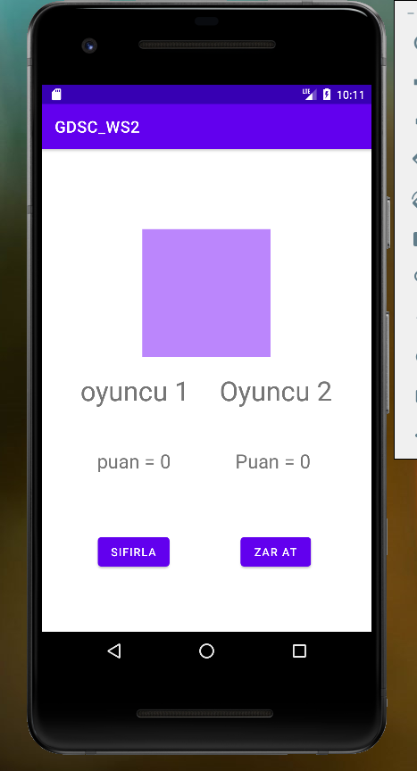

# GDSC GTU Bugdroid Workshop

## Görev 1 Sayaç uygulaması
### Aşama 1 Yapılacaklar
1. Ekrana bir buton ve yazı ekle.
2. Buton ve yazıyı hizala.
3. Buton ve yazıya id ver.
5. Buton ve yazıya id ile MainActivity.kt dosyasından eriş.
6. Yazıyı kt dosyasından "Merhaba dünya!" ile değiştir
7. Butona tıklandığında yazıyı "Merhaba Yazılımcı" olarak değiştir.

### Kopya 1
Id vermek için butona tıkla sağda Declared Attributes panelini kullan.

Kotlin dosyasından herhangi bir viewe erişmek:
```kotlin
val butonBagalantisi = findViewById<Button>(R.id.butonId)
```
Yazıyı değiştirmek: 
```kotlin
yaziBaglantisi.text = "falan filan...."
```
Buton tıklanmasına görev verme:
```kotlin
butonBagalantisi.setOnClickListener {
    
    falan filan .....
}
```

### Aşama 2 Yapılacaklar
1. Butona her basıldığında sayaç artsın
2. Azalt butonu ekleyin ve tıklandığında azaltma işlemi yapın
3. Kolay Gelsin....

### Kopya 2
Sayac isminde bir değişken oluştur ve butona tıklandığında sayacın değeri artsın sonrada sayacı ekranda göster.


## Görev 2 Zar Oyunu

### Aşama 1 Yapılacaklar
1. İnternetten zar görseli bul (iconfinder).
2. Görsellerin dosya adlarını anlamlı olacak şekilde değiştir.
3. Görselleri drawable klasörüne taşı.
4. Ekrana resim view'i ekle.
5. Resime boyut ver.
6. MainActivity.kt dosyasından resim ve butona bağlan (id ile).
7. Butona basıldığında ekranda 6 numaralı zarı göster.

### Kopya 1
Resim değiştirme:
```kotlin
resimBaglantisi.setImageResource(R.drawable.dosyaAdı)
```
### Aşama 2 Yapılacaklar
1. Resimin altında yazı view'i oluştur.
2. Butona her basıldığında yazı random sayı ile değişsin.

### Kopya 2
Random sayı oluşturma: 
```kotlin
// 1 ie 100 arasında rastgele sayı oluşturur
var randomSayi = Random.nextInt(1,100)
```
### Aşama 3 Yapılacaklar
1. Random sayı ile ekranda ki zar görselini değiştirecek bir fonksiyon yaz.
2. Yazı zar değerlerini toplamını göstersin.

### Kopya 3
fonksiyon oluşturma: 
```kotlin
fun buBirFonksiyondur(deger: int){
    val yaziBaglantisi = findViewById<TextView>(R.id.yaziId)
    
    yaziBaglantisi.text = deger.toString()
}
```
### Aşama 4 Yapılacaklar
1. Haydi oyunumuzu biraz daha gelişirelim görselde ki fonksiyonları ekleyelim.
2. Zar ilk kez atıldığında puan 1. oyuncuya, tekrar atıldığında ise 2. oyuncuya eklensin bu şekilde devam etsin.
3. Sıfırla butonu oyunu sıfırlasın.


